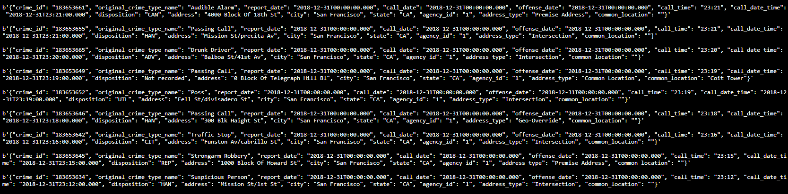
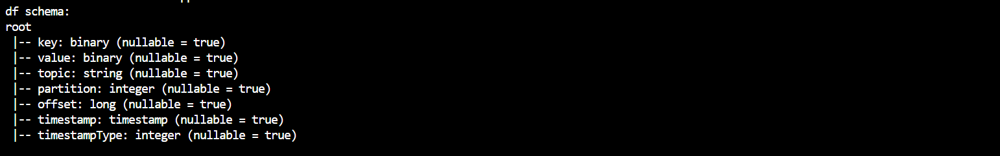
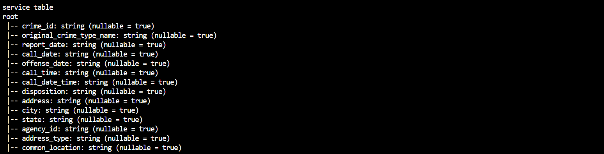
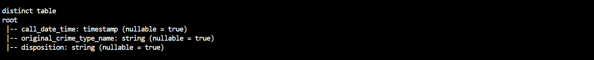
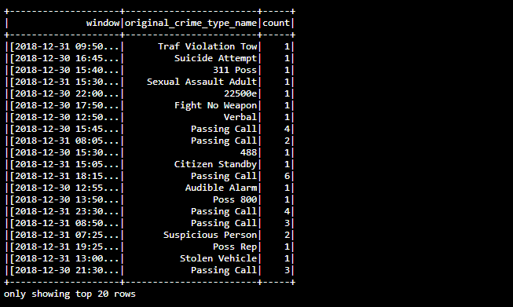
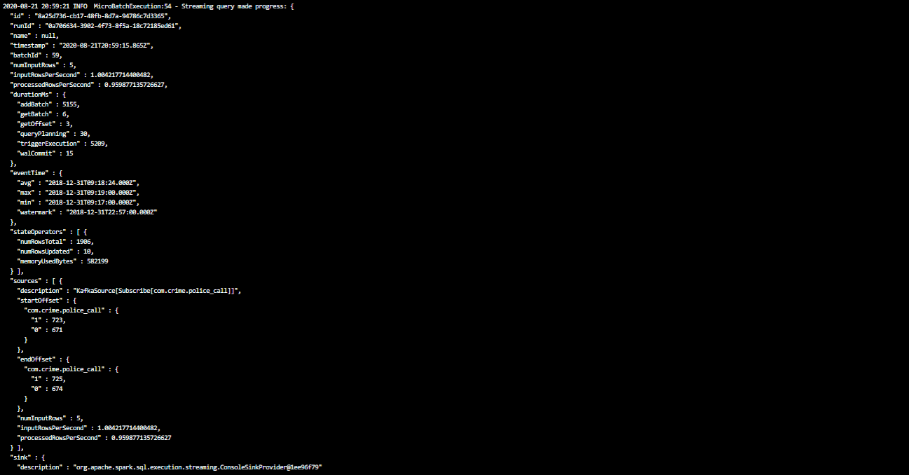

# Kafka-spark-crime-analysis
This project provides statistical analysis of the San Francisco crime incidents using Apache Kafka and Spark Structured Streaming.

A Kafka server is used to produce data, and ingest data. Data analysis is done by Spark Structured Streaming to answer the question: what are the top types of crimes in San Fransisco?

We use window for analysis and it is set to 10 min and sliding each 5 min. We also use watermark to solve dealing with late arriving data and stateful aggregation. 

Data used for this project is from Kaggle police-department-calls-for-service.json . this file has 199999 rows of data. Here is a sample row of this data:

{crime_id:"183653756", 
original_crime_type_name:"Traf Violation Cite", 
report_date:"2018-12-31T00:00:00.000", 
call_date:"2018-12-31T00:00:00.000", 
offense_date:"2018-12-31T00:00:00.000", 
call_time:"23:54", 
call_date_time:"2018-12-31T23:54:00.000", 
disposition:"ARR", 
address:"100 Blk Howard St", 
city:"San Francisco", 
state:"CA", 
agency_id:"1", 
address_type:"Geo-Override", 
common_location:""}

radio_code.json file contains description for disposition code:
{disposition_code:"ARR", description:"Arrest"}

# Development Environment
If you wish to develop the project locally, you will need to set up your environment properly as described below:

Spark 2.4.3

Scala 2.11.x

Java 1.8.x

Kafka build with Scala 2.11.x

Python 3.6.x or 3.7.x

### For Macs or Linux:
- Download Spark from https://spark.apache.org/downloads.html. Choose "Prebuilt for Apache Hadoop 2.7 and later."
- Unpack Spark in one of your folders (I usually put all my dev requirements in /home/users/user/dev).
- Download binary for Kafka from this location https://kafka.apache.org/downloads, with Scala 2.11, version 2.3.0. Unzip in your local directory where you unzipped your Spark binary as well. Exploring the Kafka folder, you’ll see the scripts to execute in bin folders, and config files under config folder. You’ll need to modify zookeeper.properties and server.properties.
- Download Scala from the official site, or for Mac users, you can also use brew install scala, but make sure you download version 2.11.x.
- Run below to verify correct versions: 

  `java -version`

  `scala -version`

- Make sure your ~/.bash_profile looks like below (might be different depending on your directory):

  `export SPARK_HOME=/Users/dev/spark-2.4.3-bin-hadoop2.7`
  
  `export JAVA_HOME=/Library/Java/JavaVirtualMachines/jdk1.8.0_181.jdk/Contents/Home`
  
  `export SCALA_HOME=/usr/local/scala/`
  
  `export PATH=$JAVA_HOME/bin:$SPARK_HOME/bin:$SCALA_HOME/bin:$PATH`
 
### For Windows:
Please follow the directions found in this helpful StackOverflow post: https://stackoverflow.com/questions/25481325/how-to-set-up-spark-on-windows

# How to run
Install requirements using `conda install --file requirements.txt` if you use conda for Python. If you use pip rather than conda, then use `pip install -r requirements.txt`

### Run Zookeeper and kafka servers
Use the commands below to start the Zookeeper and Kafka servers. You can find the bin and config folder in the Kafka binary that you have downloaded and unzipped.

`bin/zookeeper-server-start.sh config/zookeeper.properties`

`bin/kafka-server-start.sh config/server.properties`

### Create a topic: 
run `kafka-topics --create --topic "com.crime.police_call" --partitions 2 --replication-factor 1 --zookeeper localhost:2181`

### Run kafka producer 
`python kafka_server.py`

This is going to create a kafka producer and ingest data into kafka topic

### Run kafka consumer
To see if the server is correctly implemented, use the command:
`python kafka_consumer.py` 

or run `bin/kafka-console-consumer.sh --bootstrap-server localhost:9092 --topic "com.crime.police_call" --from-beginning`

Output looks like this:

### Run spark analysis application 
`spark-submit --packages org.apache.spark:spark-sql-kafka-0-10_2.11:2.3.4 --master local[*] data_stream.py`

The application has many processing steps. The following screenshots show progress:

Kafka is producing one message per 1 sec --> 60 messages per one minutes. Our topic has 2 partitions and our window is set to 10 min and sliding each 5 min. so we will have 300 records per 5 min to process. 

The application is processing approximately 60 records per min by setting maxRatePerPartition to 50 and maxOffsetsPerTrigger to 100 . 

# Discussion
1. How did changing values on the SparkSession property parameters affect the throughput and latency of the data?

we changed parameters and have the following results:

"maxOffsetsPerTrigger": 60 , "maxRatePerPartition": 30  ---> "inputRowsPerSecond" : 0.93  , "processedRowsPerSecond" : 0.90
"maxOffsetsPerTrigger": 100 , "maxRatePerPartition": 30  ---> "inputRowsPerSecond" : 0.96 , "processedRowsPerSecond" : 0.96
"maxOffsetsPerTrigger": 100 , "maxRatePerPartition": 50  ---> "inputRowsPerSecond" : 1.0 , "processedRowsPerSecond" :  0.95
"maxOffsetsPerTrigger": 200 , "maxRatePerPartition": 100  ---> "inputRowsPerSecond" : 1.01 , "processedRowsPerSecond" : 0.98 
"maxOffsetsPerTrigger": 200 , "maxRatePerPartition": 200  ---> "inputRowsPerSecond" : 0.94 , "processedRowsPerSecond" : 0.92

From results we see that throughput is mainly influenced by the parameter maxRatePerPartition

2. What were the 2-3 most efficient SparkSession property key/value pairs? Through testing multiple variations on values, how can you tell these were the most optimal?

From analysing results we see that maxOffsetsPerTrigger and maxRatePerPartition were the most efficient properties. 

optimal results are archieved with "maxOffsetsPerTrigger": 100 , "maxRatePerPartition": 50  ---> "inputRowsPerSecond" : 1.0 , "processedRowsPerSecond" :  0.95 

this throughput is suitable for kafka producting rate (1 row per second). 
